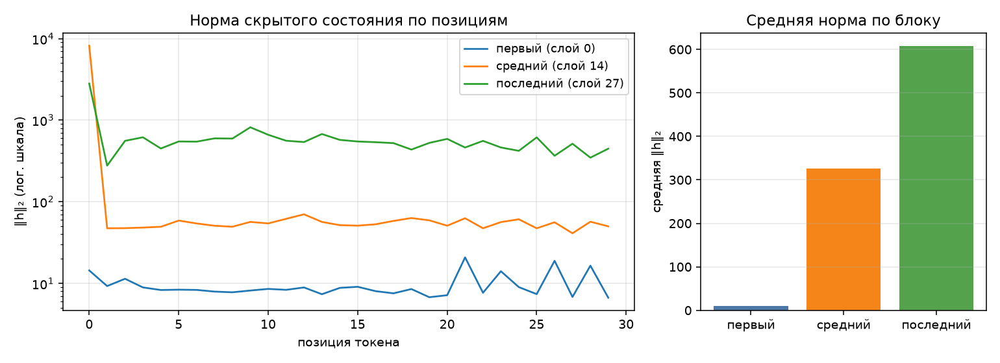

# Анатомия Qwen3-0.6B

Сгенерировано `make inspect`. dtype `bfloat16`, device `cpu`.

## 1. Конфигурация

| Параметр | Значение |
|---|--:|
| слоёв | 28 |
| hidden_size | 1024 |
| intermediate_size | 3072 |
| голов запроса | 16 |
| KV-голов (GQA) | 8 |
| head_dim | 128 |
| словарь | 151 936 |
| tie_word_embeddings | True |

GQA: 16 голов запроса на 8 KV-головы — KV-cache вдвое меньше, чем при обычном multi-head.

## 2. Условия замера

| Условие | Значение |
|---|---|
| платформа | Windows-11-10.0.26200-SP0 (Windows 11, AMD64) |
| устройство | `cpu` |
| dtype | `bfloat16` |
| seq_len × batch | 256 × 1 |
| прогонов на режим | 1 |
| память измерена | `peak_wset` |
| RSS измерена | `peak_wset` |
| python | 3.14.0 |
| torch | 2.14.0+cpu |
| transformers | 5.17.0 |
| peft | 0.20.0 |

Цифры ниже верны только для этих условий. Замер памяти без указания
устройства, dtype, длины последовательности и метрики не воспроизводится
и не сравнивается — поэтому источник метрики стоит отдельной строкой.
Сверьте, что в этой строке названа метрика, уместная для вашего
устройства, и что полученные числа с ней согласуются.

## 3. Параметры по типам модулей

| Группа | Модулей | Shape | Параметров | Доля | Разделяет тензор |
|---|--:|---|--:|--:|--:|
| `embed` | 1 | 151936×1024 | 155 582 464 | 26.10% | — |
| `q_proj` | 28 | 2048×1024 | 58 720 256 | 9.85% | — |
| `k_proj` | 28 | 1024×1024 | 29 360 128 | 4.93% | — |
| `v_proj` | 28 | 1024×1024 | 29 360 128 | 4.93% | — |
| `o_proj` | 28 | 1024×2048 | 58 720 256 | 9.85% | — |
| `gate_proj` | 28 | 3072×1024 | 88 080 384 | 14.78% | — |
| `up_proj` | 28 | 3072×1024 | 88 080 384 | 14.78% | — |
| `down_proj` | 28 | 1024×3072 | 88 080 384 | 14.78% | — |
| `norm` | 113 | 128, 1024 | 65 536 | 0.01% | — |
| `lm_head` | 1 | 151936×1024 | 0 | 0.00% | 155 582 464 |
| **итого** | | | **596 049 920** | 100% | |

Контроль: `sum(p.numel() for p in model.parameters())` = 596 049 920 — сходится с суммой по таблице.

Обратите внимание на строку `lm_head` и на значение `tie_word_embeddings`
в конфигурации: они связаны, и от этой связи зависит итог таблицы.

## 4. Нормы активаций (forward-hooks)

Промпт: «Объясни, что такое MLOps, в трёх предложениях.», 30 токенов после chat template.

| Блок | Индекс | Средняя ‖h‖₂ | Максимум |
|---|--:|--:|--:|
| первый | 0 | 9.7 | 20.9 |
| средний | 14 | 325.5 | 8189.7 |
| последний | 27 | 607.1 | 2815.4 |

Норма растёт от блока к блоку — прямое следствие residual-связей: блок
добавляет к потоку, а не заменяет его. Максимум на порядок-два выше среднего,
и сидит он на первой позиции: это attention sink, массивная активация,
в которую модель складывает «внимание ни к чему». Поэтому шкала на графике
логарифмическая — в линейной один этот выброс придавил бы всё остальное.

Прогон с хуками должен быть повторяемым: второй вызов в том же процессе
обязан дать те же числа и не оставить следов на модулях.

## 5. Сколько параметров добавляет LoRA

| Конфиг | Целевых модулей | Своя формула | peft | Совпало | % от базовой |
|---|--:|--:|--:|:-:|--:|
| r=8, q_proj+v_proj | 2 типов | 1 146 880 | 1 146 880 | да | 0.192% |
| r=16, все линейные | 7 типов | 10 092 544 | 10 092 544 | да | 1.693% |

Формула: `r * (in_features + out_features)` на каждый целевой `Linear` —
`A` формы `(r, in)`, `B` формы `(out, r)`, смещений нет. Расхождение с
`print_trainable_parameters()` означает ошибку в списке целевых модулей,
а не «разные способы считать».

Доля в таблице считается от базовой модели. `peft` печатает свою долю от
модели ВМЕСТЕ с адаптером, поэтому его процент чуть меньше — числитель
у обоих один и тот же.

## 6. Память в трёх режимах

Один шаг на seq_len=256, batch=1, device=cpu. Метрика — RSS процесса (`peak_wset`), пик за прогон; колонка «Пик RSS» снята через `peak_wset`.
Вход — случайные id токенов: меряется память, а не качество, и loss здесь
смысловой нагрузки не несёт (у full FT и LoRA он одинаковый, потому что
`B` в адаптере инициализирован нулями и до первого шага ничего не меняет).
Числа должны отличаться: по лекции full fine-tune стоит кратно дороже
инференса, а LoRA лежит между ними.

| Режим | Пик, МБ | Пик RSS, МБ | × к инференсу | Секунд | loss |
|---|--:|--:|--:|--:|--:|
| инференс | 1880 | 1880 | 1.00 | 11.7 | — |
| full fine-tune | 4851 | 4851 | 2.58 | 759.6 | 13.9603 |
| LoRA (r=8, q/v) | 2562 | 2562 | 1.36 | 674.5 | 13.9603 |

Прикидка из лекции: веса bf16 — 1137 МБ. Full fine-tune добавляет
градиенты (+1137 МБ) и два состояния AdamW (+2274 МБ),
то есть ×4 к весам ещё до активаций — что и видно в замере.
LoRA обучает 1 146 880 параметров вместо 596 049 920:
градиенты и состояния оптимизатора считаются только для адаптера, базовые
веса заморожены. Остаётся расход на активации — поэтому LoRA всё же дороже
инференса, хоть и втрое дешевле полного дообучения.

Устройство — `cpu`, поэтому основная метрика и есть RSS процесса (`peak_wset`), обе колонки совпадают.
На mps и cuda они разошлись бы: там тензоры лежат в памяти ускорителя
и в RSS почти не видны, а разница между режимами исчезает.

## Дефекты
### Дефект 1. Хуки навешивались, но не снимались
**В чём был:** forward_hooks регистрировал хуки, но не возвращал handles, и activation_norms их не снимал.
**Как проявлялся:** повторный прогон в одном процессе накапливал хуки — len(module._forward_hooks) рос, активации считались дважды, память росла.
**Как исправлен:** forward_hooks возвращает список handles, activation_norms снимает их в блоке finally (сработает даже при исключении).
**Число:** после двух прогонов подряд зарегистрированных хуков — 0 (проверка 3 в make check).\

### Дефект 2. Tied embeddings посчитаны дважды
**В чём был:** parameter_rows обходил named_parameters(remove_duplicate=False) и суммировал все тензоры подряд, включая lm_head, который делит тензор с embed_tokens.
**Как проявлялся:** сумма по таблице (751 632 384) не сходилась с sum(p.numel()) (596 049 920) — итог был на 26% больше.
**Как исправлен:** в parameter_rows добавлен seen = set() по id(param); повторный тензор помечается флагом tied=True и в сумму params не идёт.
**Число:** таблица даёт 596 049 920 = sum(p.numel() for p in model.parameters()); в строке lm_head — 0 параметров, в колонке «разделяет тензор» — 155 582 464.

### Дефект 3. Память снималась один раз в конце, после сборки мусора
**В чём был:** все три режима прогонялись в одном процессе, а PeakMemory.__exit__ делал gc.collect() и фиксировал текущий остаток.
**Как проявлялся:** это не пик, а остаток; числа ровные, разница режимов стёрта, потому что пиковые метрики — high-water mark за жизнь процесса.
**Как исправлен:** memory_profile запускает каждый режим отдельным процессом через python -m src.inspect_model --probe <mode> (subprocess) и парсит JSON; для CUDA дополнительно сбрасывается reset_peak_memory_stats.
**Число:** режимы дают разные пики — инференс 1880 МБ, full FT 4851 МБ, LoRA 2562 МБ (full FT > LoRA > инференс).

### Дефект 4. На ускорителе память мерилась через RSS
**В чём был:** device_allocated_bytes и device_metric_source всегда возвращали peak_rss()/ru_maxrss, независимо от устройства.
**Как проявлялся:** на mps/cuda тензоры лежат в памяти ускорителя и в RSS почти не видны — три режима давали почти одинаковые числа, а «память модели» могла оказаться меньше её веса (1137 МБ в bf16).
**Как исправлен:** добавлены ветки torch.cuda.max_memory_allocated и torch.mps.driver_allocated_memory; в result() имя метрики берётся из device_metric_source, проверка 6 в make check требует torch.* на ускорителе.
**Число:** на CPU metric_source = peak_wset (корректно); на cuda/mps метка стала бы torch.cuda.max_memory_allocated / torch.mps.driver_allocated_memory.